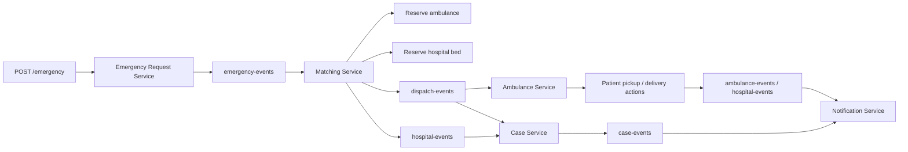

# Medical Emergency Coordination System

A distributed, event-driven medical emergency coordination platform built with Spring Boot, Kafka, PostgreSQL, Redis, Docker Compose, and Maven.

The current implementation focuses on proving the core emergency dispatch workflow:



## Tech Stack

| Layer | Technology |
| --- | --- |
| Backend | Java 21, Spring Boot 4 |
| Build | Maven multi-module project |
| API | REST |
| Messaging | Apache Kafka |
| Serialization | JSON |
| Databases | PostgreSQL per stateful service |
| Cache / location store | Redis |
| Local infrastructure | Docker Compose |
| Reliability patterns | Transactional outbox, idempotent consumers, saga compensation in matching |

## Active Services

| Service | Port | Main responsibility |
| --- | ---: | --- |
| Emergency Request Service | 8082 | Accept emergency requests and write `EmergencyRequestedEvent` to outbox |
| Ambulance Service | 8083 | Store ambulances, reserve/update ambulance status, publish pickup/delivery events |
| Location Service | 8084 | Simulate ambulance locations and store latest positions in Redis |
| Matching Service | 8085 | Consume emergencies, pick resources, reserve ambulance/hospital, run dispatch saga |
| Hospital Service | 8086 | Store hospitals and reserve beds |
| Case Service | 8087 | Combine dispatch and hospital events into an official emergency case |
| Notification Service | 8088 | Consume case/patient lifecycle events and log notifications |

The `api-gateway`, `user-service`, `k8s`, and `observability` folders exist in the repo, but they are not required for the current local end-to-end flow.

## Infrastructure

`docker-compose.yml` starts the local infrastructure only:

| Container | Local port | Notes |
| --- | ---: | --- |
| Kafka | 29092 | Event broker |
| Redis | 6379 | Latest ambulance locations |
| emergency-db | 5434 | `emergency_request_db` |
| ambulance-db | 5435 | `ambulance_service` |
| hospital-db | 5436 | `hospital_db` |
| matching-db | 5437 | `matching_db` |
| case-db | 5439 | `case_db` |

PostgreSQL username and password are both `medical`.

## Kafka Topics

Topics are defined in `shared/src/main/java/org/example/shared/config/KafkaTopics.java`.

| Topic | Main events |
| --- | --- |
| `emergency-events` | `EmergencyRequestedEvent` |
| `dispatch-events` | `DispatchAssignedEvent` |
| `hospital-events` | `HospitalAssignedEvent`, `PatientDeliveredEvent` |
| `ambulance-events` | `PatientPickedUpEvent` |
| `location-events` | `AmbulanceLocationUpdatedEvent` |
| `case-events` | `CaseCreatedEvent` |
| `notification-events` | Reserved for later notification expansion |

Important: `hospital-events` currently carries more than one event type. Consumers inspect the JSON shape and skip messages that are not meant for them.

## Reliability Model

Several services use the transactional outbox pattern:

1. The service saves local state and an outbox row in the same database transaction.
2. A scheduled outbox publisher reads pending rows.
3. The publisher sends the JSON payload to Kafka.
4. The row is marked as published only after Kafka acknowledges the send.

Consumers are idempotent where needed by recording processed event IDs. Matching also stores saga state so it can release a reserved ambulance if a later step fails before the dispatch is completed.

## Run Locally

Prerequisites:

- Java 21
- Maven
- Docker Desktop

Start infrastructure:

```powershell
docker compose up -d
docker compose ps
```

Build the project:

```powershell
mvn clean install -DskipTests
```

Run services in separate terminals:

```powershell
mvn -pl emergency-request-service spring-boot:run
mvn -pl ambulance-service spring-boot:run
mvn -pl location-service spring-boot:run
mvn -pl matching-service spring-boot:run
mvn -pl hospital-service spring-boot:run
mvn -pl case-service spring-boot:run
mvn -pl notification-service spring-boot:run
```

Each service exposes Actuator health:

```powershell
curl http://localhost:8082/actuator/health
curl http://localhost:8083/actuator/health
curl http://localhost:8084/actuator/health
curl http://localhost:8085/actuator/health
curl http://localhost:8086/actuator/health
curl http://localhost:8087/actuator/health
curl http://localhost:8088/actuator/health
```

## End-to-End Test Flow

You can use `emergency-request-service/test.http` as the manual test suite.

Basic flow:

1. Check seeded ambulances:

```http
GET http://localhost:8083/ambulances
```

2. Check seeded hospitals:

```http
GET http://localhost:8086/hospitals?minBeds=1
```

3. Create an emergency:

```http
POST http://localhost:8082/emergency
Content-Type: application/json

{
  "patientId": "Patient-007",
  "severity": "CRITICAL",
  "latitude": 20.29,
  "longitude": 85.81
}
```

Expected result:

- Emergency Request Service stores the request and publishes `EmergencyRequestedEvent`.
- Matching Service consumes it, reserves an ambulance and a hospital bed, then publishes `DispatchAssignedEvent` and `HospitalAssignedEvent`.
- Case Service receives both events and publishes `CaseCreatedEvent`.
- Notification Service logs the case notification.

4. Simulate paramedic pickup:

```http
POST http://localhost:8083/ambulances/{ambulanceId}/pickup/{emergencyId}
```

Expected result:

- Ambulance becomes `IN_TRANSIT`.
- Ambulance Service publishes `PatientPickedUpEvent`.
- Notification Service logs the pickup update.

5. Simulate patient delivery:

```http
POST http://localhost:8083/ambulances/{ambulanceId}/deliver/{emergencyId}/{hospitalId}
```

Expected result:

- Ambulance becomes `AVAILABLE`.
- Ambulance Service publishes `PatientDeliveredEvent`.
- Notification Service logs the delivery update.

6. Inspect official cases:

```http
GET http://localhost:8087/cases
```

## Useful Endpoints

| Method | Endpoint | Description |
| --- | --- | --- |
| `POST` | `http://localhost:8082/emergency` | Create an emergency request |
| `GET` | `http://localhost:8083/ambulances` | List ambulances |
| `GET` | `http://localhost:8083/ambulances?status=AVAILABLE` | List ambulances by status |
| `PATCH` | `http://localhost:8083/ambulances/{id}/status` | Update ambulance status |
| `POST` | `http://localhost:8083/ambulances/{ambulanceId}/pickup/{emergencyId}` | Mark patient picked up |
| `POST` | `http://localhost:8083/ambulances/{ambulanceId}/deliver/{emergencyId}/{hospitalId}` | Mark patient delivered |
| `GET` | `http://localhost:8084/locations` | List simulated ambulance locations |
| `GET` | `http://localhost:8084/locations/{ambulanceId}` | Get one ambulance location |
| `GET` | `http://localhost:8086/hospitals?minBeds=1` | List hospitals with available beds |
| `PATCH` | `http://localhost:8086/hospitals/{id}/reserve-bed` | Reserve one hospital bed |
| `GET` | `http://localhost:8087/cases` | List emergency cases |
| `GET` | `http://localhost:8087/cases/{caseId}` | Get one emergency case |

## Tests

Run the current event-chain services:

```powershell
mvn test -pl emergency-request-service,ambulance-service,matching-service,case-service,notification-service -am
```

Run the broader local Phase 2 set:

```powershell
mvn test -pl emergency-request-service,ambulance-service,location-service,matching-service,hospital-service,case-service,notification-service -am
```

## Troubleshooting

If Kafka logs old serialization errors after a fix, old messages may still be present in the topic. Restart consumers or clear/recreate the local Kafka data if you want a completely clean run.

If you see a log like this:

```text
Received non-delivery event on hospital-events topic; skipping.
```

that is expected while `hospital-events` carries both hospital assignment and patient delivery events. It means the notification delivery consumer saw a `HospitalAssignedEvent` and ignored it correctly.

If a service cannot connect to a database, check `docker compose ps` and confirm the matching port from the infrastructure table above.
