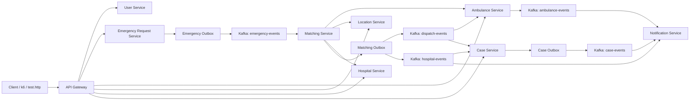

# Medical Emergency Coordination System

A distributed, event-driven medical emergency coordination platform built with Java 21, Spring Boot 4, Kafka, PostgreSQL, Redis, Docker Compose, Kubernetes, Prometheus, Grafana, and k6.

The project is currently beyond the Phase 1 MVP. It includes the emergency dispatch flow, ambulance location simulation, hospital reservation, case creation, notification consumers, JWT-based gateway authorization, Kubernetes manifests, HPA configuration, and a simplified Phase 6 observability setup.



## Current Stack

| Layer | Technology |
| --- | --- |
| Backend | Java 21, Spring Boot 4 |
| Build | Maven multi-module project |
| API | REST through Spring Cloud Gateway |
| Auth | JWT login/register through `user-service`, role checks in `api-gateway` |
| Messaging | Apache Kafka, JSON events |
| Databases | PostgreSQL per stateful service |
| Location cache | Redis |
| Reliability | Transactional outbox, idempotent consumers, saga compensation |
| Containers | Docker Compose and per-service Dockerfiles |
| Orchestration | Kubernetes manifests under `k8s/` |
| Autoscaling | Matching Service HPA |
| Observability | Micrometer, Prometheus, Grafana, kube-state-metrics, k6 |

## Services

| Service | Local port | K8s service | Responsibility |
| --- | ---: | --- | --- |
| API Gateway | 8080 | NodePort `30080` | Routes external API traffic and enforces JWT authorization |
| User Service | 8081 | `user-service` | Registers users and issues JWTs |
| Emergency Request Service | 8082 | `emergency-request-service` | Accepts emergencies and publishes `EmergencyRequestedEvent` through outbox |
| Ambulance Service | 8083 | `ambulance-service` | Stores ambulances, reserves/updates status, emits pickup events |
| Location Service | 8084 | `location-service` | Simulates ambulance locations and stores latest coordinates in Redis |
| Matching Service | 8085 | `matching-service` | Consumes emergencies, selects resources, reserves ambulance/hospital, runs dispatch saga |
| Hospital Service | 8086 | `hospital-service` | Stores hospitals and reserves beds |
| Case Service | 8087 | `case-service` | Correlates dispatch and hospital events into official cases |
| Notification Service | 8088 | `notification-service` | Consumes case and patient lifecycle events and logs notifications |

## Kafka Topics

Topics are defined in `shared/src/main/java/org/example/shared/config/KafkaTopics.java`.

| Topic | Main events |
| --- | --- |
| `emergency-events` | `EmergencyRequestedEvent` |
| `dispatch-events` | `DispatchAssignedEvent` |
| `hospital-events` | `HospitalAssignedEvent`, `PatientDeliveredEvent` |
| `ambulance-events` | `PatientPickedUpEvent` |
| `location-events` | `AmbulanceLocationUpdatedEvent` |
| `case-events` | `CaseCreatedEvent` |
| `notification-events` | Reserved for later expansion |

Kafka is configured with `6` default partitions for better matching-service parallelism.

## Reliability Model

The core write-and-publish path uses the transactional outbox pattern:

1. A service writes local state and an outbox row in the same database transaction.
2. A scheduled publisher sends pending outbox rows to Kafka.
3. The row is marked `PUBLISHED` only after Kafka accepts the send.
4. Consumers record processed event IDs where duplicate delivery would be harmful.

Matching Service also stores saga state. If it reserves an ambulance and then fails before completing dispatch, it compensates by releasing the ambulance back to `AVAILABLE`.

## Run With Docker Compose

Prerequisites:

- Java 21
- Maven
- Docker Desktop

Start the full local stack:

```powershell
docker compose up -d --build
docker compose ps
```

The Compose stack starts Kafka, Redis, all PostgreSQL databases, and all application services.

Build locally without containers:

```powershell
mvn clean install -DskipTests
```

Run tests for the main event chain:

```powershell
mvn test -pl emergency-request-service,ambulance-service,location-service,matching-service,hospital-service,case-service,notification-service -am
```

## Run On Kubernetes

The Kubernetes setup is designed for Docker Desktop Kubernetes. It runs the application services in the `mediflow` namespace while using Docker Compose infrastructure through `host.docker.internal`.

Start infrastructure first:

```powershell
docker compose up -d kafka redis user-db emergency-db ambulance-db hospital-db matching-db case-db notification-db
```

Build local images:

```powershell
docker build -t mediflow/api-gateway:latest -f api-gateway/Dockerfile .
docker build -t mediflow/user-service:latest -f user-service/Dockerfile .
docker build -t mediflow/emergency-request-service:latest -f emergency-request-service/Dockerfile .
docker build -t mediflow/ambulance-service:latest -f ambulance-service/Dockerfile .
docker build -t mediflow/location-service:latest -f location-service/Dockerfile .
docker build -t mediflow/matching-service:latest -f matching-service/Dockerfile .
docker build -t mediflow/hospital-service:latest -f hospital-service/Dockerfile .
docker build -t mediflow/case-service:latest -f case-service/Dockerfile .
docker build -t mediflow/notification-service:latest -f notification-service/Dockerfile .
```

Apply Kubernetes manifests:

```powershell
kubectl apply -f k8s/namespace.yaml
kubectl apply -f k8s/secrets
kubectl apply -f k8s/configmaps
kubectl apply -f k8s/user-service
kubectl apply -f k8s/emergency-service
kubectl apply -f k8s/ambulance-service
kubectl apply -f k8s/location-service
kubectl apply -f k8s/hospital-service
kubectl apply -f k8s/matching-service
kubectl apply -f k8s/case-service
kubectl apply -f k8s/notification-service
kubectl apply -f k8s/api-gateway
kubectl apply -f k8s/hpa
```

Check status:

```powershell
kubectl get pods,svc,hpa -n mediflow
```

Gateway URL:

```text
http://localhost:30080
```

## Observability

Phase 6 observability lives under `observability/`.

Apply the stack:

```powershell
kubectl apply -k observability/k8s
```

Useful URLs:

| Tool | URL |
| --- | --- |
| Prometheus | `http://localhost:30090` |
| Grafana | `http://localhost:30300` |

Grafana login:

```text
admin / mediflow
```

Dashboards:

- Business Metrics: P95 Dispatch Latency, Throughput, Saga Recovery Rate, Event Loss Rate
- Infrastructure: Matching Service Replicas and pod recovery evidence

k6 scenarios:

```powershell
docker run --rm -v "${PWD}:/workspace" -w /workspace -e BASE_URL=http://host.docker.internal:30080 grafana/k6 run observability/k6/scenarios/high-traffic.js
docker run --rm -v "${PWD}:/workspace" -w /workspace -e BASE_URL=http://host.docker.internal:30080 grafana/k6 run observability/k6/scenarios/autoscaling.js
docker run --rm -v "${PWD}:/workspace" -w /workspace -e BASE_URL=http://host.docker.internal:30080 grafana/k6 run observability/k6/scenarios/kafka-failure.js
docker run --rm -v "${PWD}:/workspace" -w /workspace -e BASE_URL=http://host.docker.internal:30080 grafana/k6 run observability/k6/scenarios/hospital-failure.js
```

Latest recorded evidence is in:

- `observability/evidence/phase6-metrics.md`
- `observability/evidence/pod-recovery-time.md`

Recent benchmark notes:

- Peak accepted throughput observed from Prometheus: about `44 req/sec`
- Final k6 completed throughput under the 30 req/sec run: about `12.8 req/sec`
- P95 dispatch latency under load still hits the `30s` histogram bucket
- Replacement pod readiness for API Gateway was about `109s`, while service availability remained up because another replica stayed ready

These numbers show the observability pipeline works, but matching's per-event REST/database reservation path is still the main performance bottleneck.

## End-To-End API Flow

Use `emergency-request-service/test.http` for the maintained manual flow.

Through the gateway:

1. Register or log in through `/api/auth`.
2. Use the returned JWT as `Authorization: Bearer <token>`.
3. Create an emergency through `POST /api/emergency`.
4. Matching consumes the emergency event and reserves ambulance/hospital resources.
5. Case Service creates an official case when dispatch and hospital events are both present.
6. Notification Service logs case, pickup, and delivery events.

Direct service calls still work locally when running services outside the gateway, but the current Kubernetes and load-test path uses the API Gateway.

## Useful Local Endpoints

| Method | Endpoint | Description |
| --- | --- | --- |
| `POST` | `http://localhost:8080/api/auth/register` | Register a user |
| `POST` | `http://localhost:8080/api/auth/login` | Get a JWT |
| `POST` | `http://localhost:8080/api/emergency` | Create an emergency through the gateway |
| `GET` | `http://localhost:8080/api/ambulances` | List ambulances |
| `GET` | `http://localhost:8080/api/locations` | List latest ambulance locations |
| `GET` | `http://localhost:8080/api/hospitals?minBeds=1` | List hospitals with available beds |
| `GET` | `http://localhost:8080/api/cases` | List official cases |

Kubernetes gateway equivalents use `http://localhost:30080`.

## Troubleshooting

If Kafka lag is left over from a stress test, inspect the matching consumer group:

```powershell
docker compose exec -T kafka /opt/kafka/bin/kafka-consumer-groups.sh --bootstrap-server localhost:9092 --describe --group matching-service-group
```

If all ambulances are stuck as `RESERVED` after a local benchmark, reset only local test data:

```powershell
docker compose exec -T ambulance-db psql -U medical -d ambulance_db -c "update ambulances set status = 'AVAILABLE';"
```

If you see a notification log that says a non-delivery hospital event was skipped, that is expected. The `hospital-events` topic carries multiple event shapes, and consumers ignore messages that are not meant for them.
