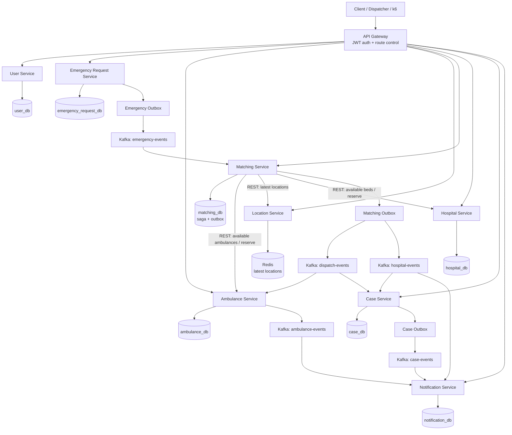
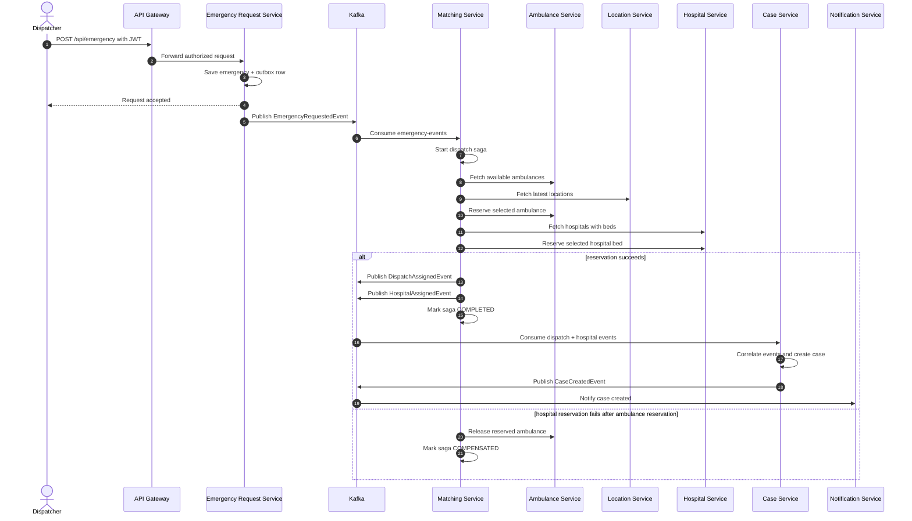

# Medical Emergency Coordination System

MediFlow is a distributed, event-driven emergency dispatch platform built with Spring Boot microservices, Kafka, PostgreSQL, Redis, Docker, Kubernetes, Prometheus, Grafana, and k6.

The system accepts emergency requests, assigns ambulances and hospitals, creates official cases, and emits notification events. It is designed to demonstrate real distributed-system concerns: asynchronous workflows, service boundaries, database/Kafka consistency, saga compensation, idempotent consumers, autoscaling, and observability.

## Highlights

- 8 Spring Boot domain services plus an API Gateway.
- Kafka-driven emergency dispatch workflow with REST for synchronous reservation calls.
- PostgreSQL database per stateful service.
- Redis-backed latest ambulance location state.
- Transactional outbox for reliable event publishing.
- Saga compensation in Matching Service.
- Idempotent consumers and partial DLQ support for Matching Service.
- Kubernetes deployments, services, probes, and Matching Service HPA.
- Prometheus/Grafana dashboards and k6 load/failure scenarios.

## Architecture



## UML Sequence Diagram



## Services And Connections

| Service | Owns | Connects with |
| --- | --- | --- |
| API Gateway | External routing, JWT validation, role checks | Routes to User, Emergency, Ambulance, Location, Matching, Hospital, Case, and Notification APIs |
| User Service | User registration, login, JWT issuing | PostgreSQL `user_db`; used by clients before calling protected APIs |
| Emergency Request Service | Emergency intake and request persistence | PostgreSQL `emergency_request_db`; publishes `EmergencyRequestedEvent` through outbox to Kafka |
| Ambulance Service | Ambulance records, reservation state, pickup/delivery actions | PostgreSQL `ambulance_db`; called by Matching Service; consumes dispatch events; publishes ambulance lifecycle events |
| Location Service | Latest simulated ambulance coordinates | Redis; queried by Matching Service during ambulance selection |
| Matching Service | Dispatch decision, resource reservation, saga state | Consumes `emergency-events`; calls Ambulance, Location, and Hospital services; publishes dispatch and hospital assignment events |
| Hospital Service | Hospital records and available bed count | PostgreSQL `hospital_db`; called by Matching Service for bed reservation |
| Case Service | Official emergency case creation | Consumes dispatch and hospital events; correlates both sides before creating a case |
| Notification Service | Notification event handling | Consumes case, hospital, and ambulance lifecycle events; currently logs notification output |

## Core Workflow

1. A dispatcher authenticates through the API Gateway and submits an emergency request.
2. Emergency Request Service stores the emergency and writes an `EmergencyRequestedEvent` into its outbox.
3. The outbox publisher sends the event to Kafka.
4. Matching Service consumes the event and starts a dispatch saga.
5. Matching Service selects and reserves an ambulance, then selects and reserves a hospital bed.
6. Matching Service publishes `DispatchAssignedEvent` and `HospitalAssignedEvent`.
7. Case Service correlates both assignment events and creates an official emergency case.
8. Notification Service consumes case and lifecycle events such as assignment, pickup, and delivery.

## Technology Stack

| Layer | Technology | Why it is used |
| --- | --- | --- |
| Backend | Java 21, Spring Boot 4 | Strong ecosystem for REST APIs, Kafka, JPA, security, health checks, and metrics |
| Build | Maven multi-module | Keeps each service independent while sharing parent build configuration and common contracts |
| API | REST, Spring Cloud Gateway | Simple external API access with centralized routing and JWT authorization |
| Messaging | Apache Kafka | Durable asynchronous event stream with partitions, replayability, and consumer groups |
| Data | PostgreSQL per stateful service | Transactional storage for emergencies, ambulances, hospitals, cases, sagas, idempotency, and outbox records |
| Location state | Redis | Fast access to latest ambulance coordinates |
| Containers | Docker, Docker Compose | Repeatable local infrastructure and service packaging |
| Orchestration | Kubernetes | Deployments, services, probes, config, secrets, rolling updates, and pod replacement |
| Autoscaling | Kubernetes HPA | Scales Matching Service based on CPU because it is the dispatch bottleneck |
| Observability | Micrometer, Prometheus, Grafana, k6 | Metrics collection, dashboards, and repeatable load/failure tests |

## Reliability Model

The system avoids direct database-plus-Kafka dual writes by using the Transactional Outbox pattern. A service writes business state and an outbox row in one database transaction, then a scheduled publisher sends the event to Kafka and marks it as published after Kafka accepts it.

Matching Service uses a saga because ambulance and hospital reservation happen across different services. If an ambulance is reserved but hospital reservation fails, the saga compensates by releasing the ambulance back to `AVAILABLE`.

Kafka consumers use idempotency where duplicate delivery could create incorrect side effects. Matching Service also has DLQ handling for repeatedly failing `emergency-events` messages, routing poison messages to an `*-dlq` topic pattern after retries.

## Kafka Topics

| Topic | Main events |
| --- | --- |
| `emergency-events` | `EmergencyRequestedEvent` |
| `dispatch-events` | `DispatchAssignedEvent` |
| `hospital-events` | `HospitalAssignedEvent`, `PatientDeliveredEvent` |
| `ambulance-events` | `PatientPickedUpEvent` |
| `location-events` | `AmbulanceLocationUpdatedEvent` |
| `case-events` | `CaseCreatedEvent` |
| `notification-events` | Reserved for future notification expansion |

Kafka is configured with 6 default partitions to improve Matching Service consumer parallelism.

## Kubernetes Deployment

The Kubernetes setup targets Docker Desktop Kubernetes. Application services run in the `mediflow` namespace, while local infrastructure can be provided by Docker Compose and reached from pods through `host.docker.internal`.

Key Kubernetes pieces:

- Deployments and Services for every application service.
- ConfigMaps for service URLs, database names, Kafka bootstrap servers, and topic names.
- Secrets for database passwords and JWT signing configuration.
- Startup, readiness, and liveness probes for Spring Boot services.
- API Gateway exposed through NodePort `30080`.
- Matching Service HPA with `minReplicas: 2`, `maxReplicas: 4`, and `70%` CPU target.

## Observability And Load Testing

The observability stack is under `observability/`.

- Prometheus scrapes service `/actuator/prometheus` endpoints.
- Grafana provides business and infrastructure dashboards.
- kube-state-metrics exposes Kubernetes object metrics.
- k6 scripts simulate high traffic, autoscaling pressure, Kafka failure, and hospital failure.

Tracked metrics include:

- P95 API response latency.
- P95 dispatch latency.
- Emergency request throughput.
- Saga recovery rate.
- Event loss rate.
- Matching Service replica count.
- Pod recovery evidence.

Latest local benchmark notes:

| Metric | Observed value | Meaning |
| --- | --- | --- |
| P95 API response latency | Sub-500 ms under clean low-load conditions | Time to accept and persist the emergency request |
| Peak accepted throughput | About 44 emergency requests/sec | Peak request ingestion rate observed from Prometheus |
| P95 dispatch latency under stress | About 30 seconds | Matching Service developed backlog under heavier load |
| API Gateway replacement pod readiness | About 109 seconds | Local Docker Desktop Kubernetes replacement readiness time |

The metrics show that request intake works quickly, but the asynchronous dispatch path is currently limited by Matching Service's per-event resource matching and reservation work.

## Running The Project

Start the full Docker Compose stack:

```powershell
docker compose up -d --build
docker compose ps
```

Build locally:

```powershell
mvn clean install -DskipTests
```

Run the main event-chain tests:

```powershell
mvn test -pl emergency-request-service,ambulance-service,location-service,matching-service,hospital-service,case-service,notification-service -am
```

For Kubernetes, build the service images, apply the manifests under `k8s/`, and access the gateway at:

```text
http://localhost:30080
```

For observability:

```powershell
kubectl apply -k observability/k8s
```

Grafana runs at `http://localhost:30300`, and Prometheus runs at `http://localhost:30090`.

## Project Status

The current system proves the complete distributed workflow: emergency intake, event publishing, matching, resource reservation, case creation, notifications, Kubernetes deployment, autoscaling, and observability. The main future improvement is optimizing Matching Service with geospatial lookup, fewer synchronous calls, stronger Kafka lag/DLQ dashboards, and improved dispatch latency under load.
